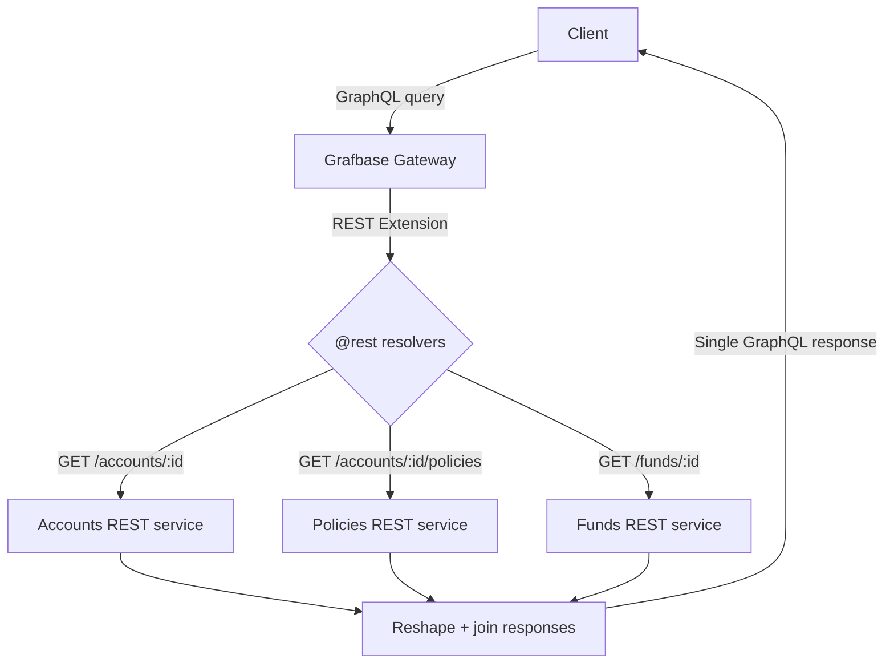

# REST Extensions on the Grafbase Gateway

> **Jira Story:** `<PROJECT-KEY>` — Implement REST Extensions on the Grafbase Gateway
> **Status:** Implemented
> **Owner:** `<team / author>`
> **Repository:** `<repo URL>`
> **Last updated:** `<date>`

---

## Overview

This story added support for **REST Extensions** on the **Grafbase Gateway**, allowing the gateway to expose one or more existing REST services through a single, unified GraphQL API — **declaratively, without writing any custom resolver code**.

The reference implementation federates three independent REST services (**Accounts**, **Policies**, and **Funds**) into one GraphQL graph. Clients issue a single GraphQL query; the gateway fans out to the appropriate REST endpoints, transforms each response, and returns a joined result.

The objective was to prove out a **schema-driven, low-boilerplate** pattern for surfacing REST backends through GraphQL that the team can reuse for future services.

---

## Problem Statement

Before this implementation:

- Backend capabilities were spread across **multiple standalone REST services**, each with its own base URL, auth, and response shape.
- Consuming clients had to **call each service individually** and stitch the responses together on the client side.
- Exposing these services through GraphQL traditionally meant **hand-writing resolvers** for every field — glue code that has to be built, tested, and maintained per service.
- There was no single place to enforce cross-cutting concerns (a unified schema, shared auth handling, consistent response shaping).

**Why REST Extensions were needed:** The Grafbase Gateway can already federate GraphQL subgraphs, but our sources are REST, not GraphQL. The REST Extension bridges that gap — it lets the gateway treat a REST API as a virtual subgraph and map REST endpoints to GraphQL fields **through schema directives instead of code**.

---

## Solution Implemented

At a high level:

- **REST Extension integration** — The gateway loads the Grafbase **REST extension** (a WebAssembly resolver extension). REST endpoints are declared on the schema and individual GraphQL fields are wired to REST calls.
- **How the gateway consumes REST APIs** — Two directives do the work:
  - `@restEndpoint` — declares a **named REST endpoint** (base URL + static/templated headers). Repeatable on the schema.
  - `@rest` — placed on a GraphQL field; specifies **which endpoint, HTTP method, path, and response selection** to use.
- **Schema generation approach** — The GraphQL types are **authored by hand** to model the desired unified API, and each field is annotated with the directive that maps it to a REST call. The `selection` argument uses **[jq](https://jqlang.org/manual/) filters** to reshape each REST JSON response into the GraphQL field's shape. Cross-service joins are expressed with the **Composite Schemas** directives (see below) rather than custom code.
- **Overall summary** — A single virtual subgraph declares three REST endpoints; root fields fetch from REST, and nested relationships are resolved through composite-schema join directives. Per-service API keys are injected from configuration/environment, never hard-coded.

### Directives used

| Directive | Source | Role in this implementation |
|-----------|--------|-----------------------------|
| `@restEndpoint` | REST extension | Declares a named REST endpoint (`accounts`, `policies`, `funds`) with base URL + `X-Api-Key` header. |
| `@rest` | REST extension | Maps a GraphQL field to an HTTP method/path and shapes the response via a jq `selection`. |
| `@key` | Composite Schemas | Marks `Fund` as an entity resolvable by `id`. |
| `@lookup` | Composite Schemas | Marks the canonical "fetch one entity by id" resolver. |
| `@require` | Composite Schemas | Injects a **parent field** (e.g. `account.id`) as a hidden argument for a child REST call. |
| `@derive` + `@is` | Composite Schemas | Builds an entity (or list of entities) from id(s) on the parent, resolving each via `@lookup`. |
| `@inaccessible` | Composite Schemas | Hides internal join fields (e.g. `fundId`) from the public API. |

> **Why the join directives are needed:** `@rest` can only build its URL from the field's own arguments (`{{ args.* }}`) and static config (`{{ config.* }}`) — it has **no access to the parent object**. Parent → child joins (e.g. an account's policies) therefore use the Composite Schemas directives to pass parent data down. Notably, **no custom Rust extension had to be written** — the shipped REST extension plus standard directives cover the whole use case.

---

## Project Architecture / Flow

```
Client (GraphQL query)
   │
   ▼
Grafbase Gateway
   │   (REST Extension resolves @rest fields;
   │    Composite Schema directives resolve joins)
   ▼
REST Endpoints  ──►  Accounts service
                ──►  Policies service
                ──►  Funds service
   │
   ▼
Responses reshaped (jq selection) + joined
   │
   ▼
Single GraphQL Response  ──►  Client
```



**Reference deployment (from `docker-compose.yml`):**

| Component | Purpose | Port (host) |
|-----------|---------|-------------|
| Grafbase Gateway | GraphQL entry point + REST extension | `5050` |
| Accounts REST service | Mock backend | `3001` |
| Funds REST service | Mock backend | `3002` |
| Policies REST service | Mock backend | `3003` |
| GraphiQL explorer | Query UI | `5173` |

> Endpoints, ports, and service names above reflect the reference/mock setup. Replace with `<your service hostnames>` and `<your ports>` for real deployments.

---

## How the Project Works

Request lifecycle for a nested query (e.g. an account with its policies and funds):

1. **Client sends one GraphQL query** to the gateway's `/graphql` endpoint.
2. The gateway resolves the **root field** (`account(id:)`) via its `@rest` directive → `GET /accounts/{id}` on the Accounts service, forwarding the configured `X-Api-Key`.
3. The **jq `selection`** on that field reshapes the REST JSON into the `Account` GraphQL type.
4. For the nested `policies` field, `@require(field: "id")` injects the parent `account.id` as a hidden argument → `GET /accounts/{accountId}/policies` on the Policies service.
5. For fund relationships, `@derive` + `@is` turn parent id(s) into `Fund` lookups, each resolved through the `@lookup` resolver → `GET /funds/{id}` on the Funds service (deduplicated where possible).
6. The gateway **merges all responses** into the shape the client requested and returns **one GraphQL response**.

Throughout, internal join fields (`fundId`, `fundIds`, the `accountId` argument) are marked `@inaccessible`/hidden, so the **public schema stays clean**.

---

## What are Grafbase REST Extensions?

- **What they are:** A gateway **resolver extension** (shipped as a WebAssembly component) that adds the `@restEndpoint` and `@rest` directives. It lets the Grafbase Gateway call REST APIs and map their responses to GraphQL fields.
- **Why Grafbase provides them:** Grafbase's extension model composes a **single unified graph from any source** — GraphQL, gRPC, databases, and REST — all with the same federation model. The REST extension is the REST connector for that model.
- **Problems they solve:** They remove the need to hand-write and maintain per-field resolver code to expose REST services through GraphQL, and they give one consistent place to declare endpoints, headers/auth, and response shaping.
- **Benefits vs. manually writing resolvers:**
  - No custom resolver code to build, test, and maintain.
  - Endpoints and mappings are **declarative and reviewable** in the schema.
  - Response shaping is expressed with standard **jq** filters.
  - Cross-service joins reuse the standard Composite Schemas directives.

---

## Key Benefits

| Benefit | What it means here |
|---------|--------------------|
| **Centralized API gateway** | One GraphQL entry point in front of many REST services. |
| **REST → GraphQL translation** | Declarative mapping from REST endpoints to GraphQL fields. |
| **Less boilerplate** | No hand-written resolvers; mappings live in the schema. |
| **Easier maintenance** | Adding/altering a field is a schema change, not new code. |
| **Schema-driven development** | The unified schema is the single source of truth. |
| **Better scalability** | New REST services are added as new endpoints + fields. |
| **Clean public API** | Internal join fields hidden via `@inaccessible`. |
| **Config-driven secrets** | Per-service API keys sourced from env, not the repo. |

---

## Official References

Use only official Grafbase documentation:

- **REST extension:** https://grafbase.com/extensions/rest
- **Gateway — Extensions overview:** https://grafbase.com/docs/gateway/extensions
- **Gateway — Extensions configuration:** https://grafbase.com/docs/gateway/configuration/extensions
- **Guide — Implementing a Gateway Resolver Extension:** https://grafbase.com/guides/implementing-a-gateway-resolver-extension
- **Grafbase Extensions (source repository):** https://github.com/grafbase/extensions
- **Grafbase SDK (Rust) reference:** https://docs.rs/grafbase-sdk/latest/grafbase_sdk/

Supporting reference:

- **jq manual** (used by the `selection` argument): https://jqlang.org/manual/

---

## Future Scope

Practical improvements to consider as this pattern is adopted more widely:

- **Authentication support** — forward client identity / propagate auth headers via gateway header rules; add an auth extension where needed.
- **Better caching** — enable subgraph/response caching with per-service TTLs to cut redundant REST calls.
- **Environment-based endpoint configuration** — drive all base URLs from environment/config per environment (dev/stage/prod) instead of schema-inline URLs.
- **Error handling improvements** — consistent mapping of REST error codes to GraphQL errors, partial-response handling, retries/timeouts.
- **Monitoring & logging** — structured request logging, tracing across REST hops, latency/error metrics.
- **Rate limiting** — protect downstream REST services from fan-out spikes.
- **Multiple environment support** — parameterized deployment across environments.
- **Extension versioning** — a clear upgrade path and pinning strategy for the REST extension version.
- **CI/CD integration** — schema composition/validation checks and automated deploys in the pipeline.
- **Additional REST service integrations** — onboard further REST backends using the same pattern.

---

## Limitations / Known Considerations

- **`@rest` has no parent context** — it can only template from `{{ args.* }}` and `{{ config.* }}`. Parent → child joins must use Composite Schemas directives (`@require`, `@derive`, `@is`, `@lookup`).
- **Fan-out cost** — list-of-ids relationships (e.g. funds per policy) can issue **one REST call per id**. Without caching, deep/large queries can generate many downstream requests.
- **Response shape coupling** — the jq `selection` must match the REST payload; upstream response changes can break field mappings until the selection is updated.
- **Endpoint/host configuration is environment-sensitive** — base URLs differ between local (`localhost` ports), containerized (service DNS names), and deployed environments; keep these externalized. *(In the reference repo, base URLs are set in `schema.graphql`; the alternate values are noted in comments.)*
- **Extension must be present at startup** — the gateway requires the extension directory/artifact to be available when it boots.
- **Reference backends are mocks** — the Accounts/Policies/Funds services in this repo are mock REST APIs for demonstration; swap in real services for production.
- **Assumption:** every REST service enforces an `X-Api-Key` header; keys are injected from configuration/environment.

---

## Summary

This story delivered a working, **schema-driven** integration of REST services into the Grafbase Gateway using the official **REST extension**. Multiple independent REST APIs are now exposed through a **single GraphQL endpoint**, with cross-service relationships resolved automatically via **Composite Schemas** directives and **zero custom resolver code**. The result is a reusable, low-boilerplate pattern for onboarding future REST backends — clean public schema, config-driven secrets, and a clear path for adding caching, auth, observability, and more.

---

> **Placeholders to fill in before publishing:** Jira story key `<PROJECT-KEY>`, repository URL, author/team, date, and any environment-specific hostnames/ports.
